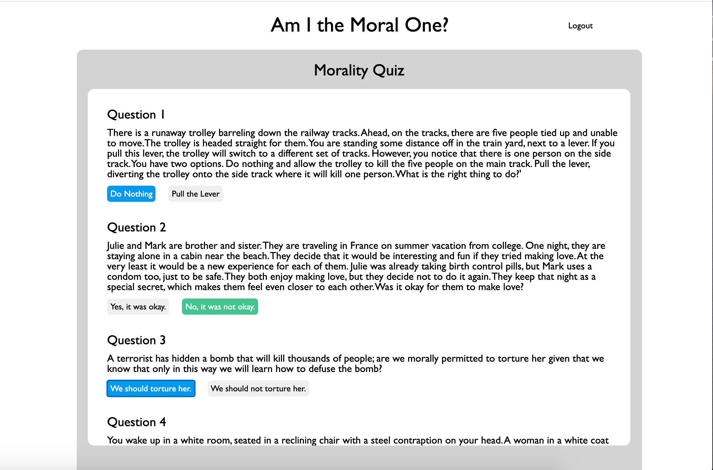

# AmITheMoralOne? 

Am I the Moral One  is a web application that asks users a series of ethical dilemmas and records their answers. After they finish the survey, they can see how their answers compare to other users, and look at answer choice patterns across demographic groups (e.g.: gender, religious affiliation, political affiliation, etc.). 

[Live Demo]( https://amithemoralone.herokuapp.com/#/)

# Technologies Used 

Am I the Moral One's backend uses MongoDB, Node.js and Express, it's frontend uses React.js. To implement the data visualization we used the Recharts API. 


# Quizzes 
 
 
In our database, we stored demographic data with each question answer. The benefit of this was that this data was easily retrievable. However, this also meant that we needed to be creative when it came to creating our quiz form functionality. Our quiz form stored an object (named functions) representing the user's answers. We updated that object each time the user selected an answer button: 

 ```js
handleClickA(){
        this.props.functions[this.props.question._id -1] = 'choiceA'; 
        if(this.state.KlassA === 'quiz-question-a'){
            this.setState({KlassA: "select-a", KlassB: 'quiz-question-b'})} else {
                this.setState({KlassA: 'quiz-question-a'})
            }
 ```
 

 
 When the user clicks the submit button, we send her answers and demographic info to our backend: 
 
 
  ```js
   handleClick(){
    
        let user = this.props.user; 
        this.props.functions.map((choice, idx) => {
            this.props.updateQuizQuestion((idx + 1), 1, choice, user.age, user.education, user.politicalLeaning, user.religiousAffilation, user.gender, user.ethnicity, user.petChoice, user.location)
        })
        this.props.history.push('/results')
           
    }
 ```
 
 Which then update's our database: 
 
 ```js
 
 router.patch("/update/:id", (req, res) => {
    filter =  { _id: req.params.id , quizNum: req.body.quizNum };
    update =  {  $inc: {
      [`question.questionChoices.${req.body.choice}.demo.age.${req.body.age}`]: 1,
     [`question.questionChoices.${req.body.choice}.demo.education.${req.body.education}`]: 1,
     [`question.questionChoices.${req.body.choice}.demo.politicalLeaning.${req.body.politicalLeaning}`]: 1,
     [`question.questionChoices.${req.body.choice}.demo.religiousAffilation.${req.body.religiousAffilation}`]: 1,
     [`question.questionChoices.${req.body.choice}.demo.gender.${req.body.gender}`]: 1,
     [`question.questionChoices.${req.body.choice}.demo.petChoice.${req.body.petChoice}`]: 1,
     [`question.questionChoices.${req.body.choice}.demo.ethnicity.${req.body.ethnicity}`]: 1,
     [`question.questionChoices.${req.body.choice}.demo.location.${req.body.location}`]: 1,
    }
     };

    Quiz.findOneAndUpdate( filter, update, function(
    err,
    result
  ) {
    if (err) {
      res.send(err);
    } else {
      res.send(result);
    }
  });
});
 ```
 
 
 # Data Visualization 
 
We used the Recharts API to visualize the demographic data for our quizes, i.e. what answers people of diffrent political ideologies gave on a given moral dilema. Here's what it looks like on our website: 
  


These graphs draw on data from our Redux state. Below are two pictures displaying a sample redux state: 


  
Here's what the pie chart looks like under the hood: 
   
   ```html
       <div className="demo-label-bolded">{labels[0]}</div>
          <div className="sample-size-label">
                 {demoGroup1A === undefined ? "" : `sample size: ${demoGroup1A + demoGroup1B}`}</div>
          </div>`

            
                <PieChart width={200} height={200}>
                    <Pie 
                        data={data}
                        cx={100}
                        cy={100}
                        labelLine={false}
                        label={renderCustomizedLabel}
                        outerRadius={80}
                        fill="#8884d8"
                        dataKey="value"
                    >
                        {
                            data.map((entry, index) => <Cell key={`cell-${index}`} fill={COLORS[index % COLORS.length]} />)
                        }
                    </Pie>
                </PieChart>

```

 # Quiz Creation 
  
 Users can create their own quizzes, which then appear on the quiz index page of our site. 

  

  # User Info 
  
Based on their answers to the first quiz, we judge whether a users moral views align more with Consequentialist or Kantian ethics. This information is displayed on the user info page.  
 
  
              
   
            


